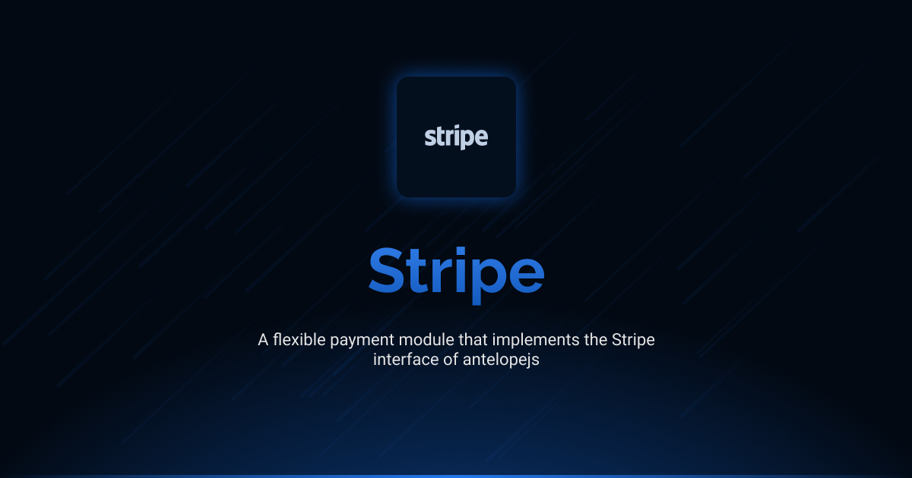

# @antelopejs/stripe

<div align="center">
<a href="https://www.npmjs.com/package/@antelopejs/stripe"></a>
<a href="./LICENSE"></a>
<a href="https://discord.gg/sjK28QHrA7"></a>
<a href="https://antelopejs.com/modules/stripe"></a>
</div>

An extensive Stripe payment processing module that implements the Stripe interface for AntelopeJS.

## Installation

```bash
ajs project modules add @antelopejs/stripe
```

## Interfaces

This module implements three interfaces. Each is installed separately to maintain modularity and minimize dependencies.

| Name          | Install command                        |                                                                        |
| ------------- | -------------------------------------- | ---------------------------------------------------------------------- |
| Stripe        | `ajs module imports add stripe`        | [Documentation](https://github.com/AntelopeJS/interface-stripe)        |
| Payment       | `ajs module imports add payment`       | [Documentation](https://github.com/AntelopeJS/interface-payment)       |
| Subscriptions | `ajs module imports add subscriptions` | [Documentation](https://github.com/AntelopeJS/interface-subscriptions) |

## Overview

The AntelopeJS Stripe module provides functionality for handling Stripe payment processing:

- Payment intent creation and management
- Webhook handling for Stripe events
- Payment method retrieval
- Payment monitoring and event watching
- Cluster-aware payment processing with Redis

## Dependencies

This module depends on the following Antelope interfaces:

- [**API Interface**](https://github.com/AntelopeJS/interface-api) (optional): mounts the built-in webhook endpoint of the Stripe interface. Consumers of the payment and subscriptions interfaces call `VerifyWebhook` from their own route instead.
- [**Redis Interface**](https://github.com/AntelopeJS/interface-redis) (optional): enables clustering, so payment intent watching works across instances.

## Subscriptions

Subscriptions are Stripe's own: Stripe holds the schedule and fires every renewal, and this module maps the subscriptions interface onto it.

- **Events come through `VerifyWebhook`.** Point a Stripe webhook at your route and pass every delivery to the payment interface's `VerifyWebhook`, as for payments. It also raises `customer.subscription.created`, `invoice.paid`, `invoice.payment_failed` and `customer.subscription.deleted` as subscription events, and waits for your `SubscriptionEvents` handlers: if one throws, `VerifyWebhook` rejects, your route answers with an error, and Stripe delivers again. Enable those four event types on the endpoint.
- **One product.** Every subscription's price hangs off a product with the fixed id `antelopejs_subscriptions`, created on first use in each account. Do not archive it.
- **The first period is charged or refused.** Subscriptions are created with `payment_behavior: "error_if_incomplete"`, so a declined first charge creates nothing and raises `SubscriptionPaymentError`. Stripe voids the declined attempt, so its payment reports `canceled`; the decline code is in `providerCode`.
- **Statuses.** `unpaid`, `paused` and `incomplete` are reported as `past_due`; `incomplete_expired` as `canceled`. What happens after `past_due` follows the retry settings in your Stripe dashboard. Set it to cancel the subscription when the retries are spent: an `unpaid` subscription is never charged again and would stay `past_due` for ever. The raw status is in `vendorData`.
- **Only this module's subscriptions.** Subscriptions made elsewhere on the account — Checkout, the dashboard, `GetClient()` — are not listed, read, changed or raised as events, and their charges are not marked; they carry no `reference`.
- **Cancelling now** writes `antelopejs-idempotency-key:<key>` into the cancellation comment, because Stripe applies idempotency keys only to POST requests and a cancellation is a DELETE. That mark is how a replayed cancellation is recognised.
- **Subscription charges are marked.** A basil PaymentIntent no longer points at its invoice, so `GetPayment` and payment webhooks look the invoice up (one extra read) to set `antelopeSubscription` in the payment's metadata.
- **Times** are kept to the second, as Stripe stores them.
- **Invoice events** (`payment_succeeded`, `payment_failed`) carry the subscription as read back when the delivery is verified, so a late redelivery can show a later state than the one the event is about.
- **Prefer the generic fallback?** Wire `@antelopejs/payment-subscriptions` and add `disabledExports: ["@antelopejs/interface-subscriptions"]` to this module's entry.

## Configuration

The Stripe module can be configured with the following options:

```json
{
  "apiKey": "your_stripe_api_key",
  "webhookSecret": "your_stripe_webhook_secret",
  "endpoint": "stripe"
}
```

### Configuration Details

The module requires the following configuration properties:

- `apiKey`: Your Stripe API key for authentication with the Stripe API
- `webhookSecret`: Your Stripe webhook signing secret for verifying webhook events
- `endpoint`: The base endpoint path for Stripe webhook controller (defaults to 'stripe' if not specified)

Additional configuration properties from the Stripe.js library configuration can also be provided.

## License

This project is licensed under the Apache License 2.0 - see the [LICENSE](LICENSE) file for details.
